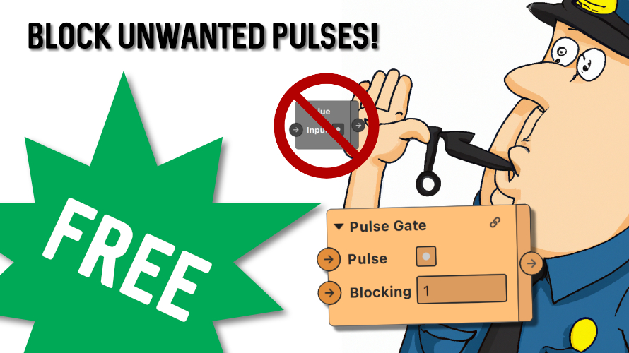

## Pulse Gate patch for Meta Spark

Pulse Gate only allows a pulse to pass through at most every X seconds.  It serves to limit the speed of inputs from a user, so you can play your animations without interruption. 

Also available in the asset library: https://www.facebook.com/sparkarhub/library/1243104566580330
